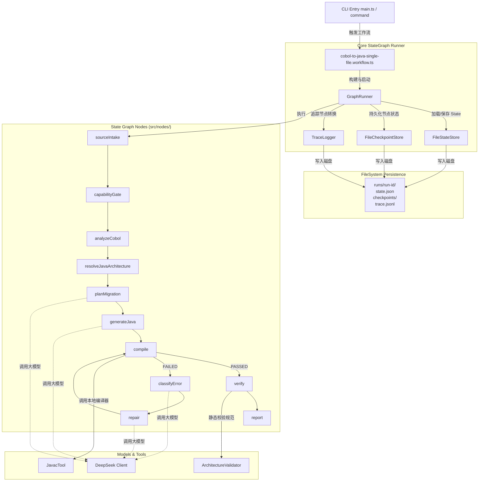
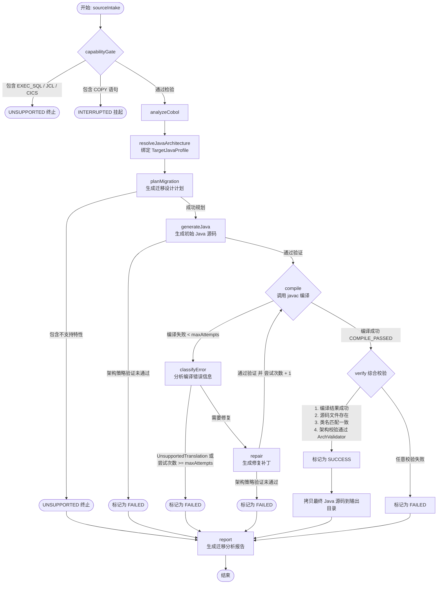
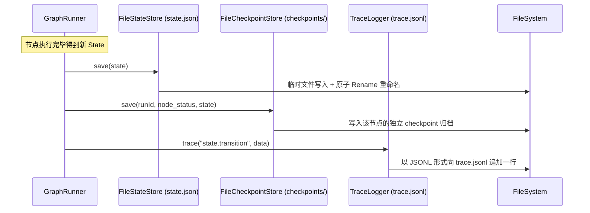

# DeepSeek Loop Engine Architecture

本项目是一个基于持久化状态图（State Graph）运行时驱动的 COBOL 到 Java 迁移引擎。它利用大模型（DeepSeek）进行迁移规划和代码生成/修复，并使用确定性编译器（javac）和架构验证器（ArchitectureValidator）进行严格把关。

---

## 1. 核心系统组件图 (System Component Diagram)

以下是引擎的核心层次结构和组件依赖关系：

---

## 2. 状态机执行流与分支决策 (State Transition Flow)

图运行时基于 `durable state-graph` 进行状态演进，其控制流与决策流如下：

---

## 3. 持久化与恢复模型 (Persistence & Checkpoint Model)

在每个节点（Node）执行完毕后，`GraphRunner` 会以**事务级**顺序保存进度，这是实现 Durable Execution 的基础：

---

## 4. 各层职责划分

| 目录/模块 | 职责与设计模式 |
| :--- | :--- |
| `src/core/graph/` | **通用无状态图运行器**。提供 `GraphRunner` 和 `GraphNode` 抽象，不涉及任何具体的 COBOL、Java 业务逻辑。 |
| `src/core/checkpoint/` | **检查点持久化**。在每个 Node 执行结束后输出一份不可变的快照，保证后续 Resume CLI 可按快照回滚或恢复。 |
| `src/core/actions/` | **安全文件行为器**。只接收模型生成的 `WRITE_FILE` 或 `PATCH_FILE` action 并对其路径进行绝对沙箱化校验后执行改动。 |
| `src/architecture/java/` | **架构规约强制器**。提供 `TargetJavaProfile`（如 plain-java-single-class-v1）和 `ArchitectureValidator`，静态分析并拒绝任何引入了框架、多文件或 package 的非合规 Java 代码。 |
| `src/nodes/` | **业务图节点**。各步骤状态演进的直接执行者，调用大模型或工具（如 `javac`）。 |
| `src/tools/` | **物理工具适配器**。如 `JavacTool` 以 `shell: false` 形式安全地孵化编译器子进程，提供超时控制和最大 2 MiB 的缓冲区截断保护。 |
