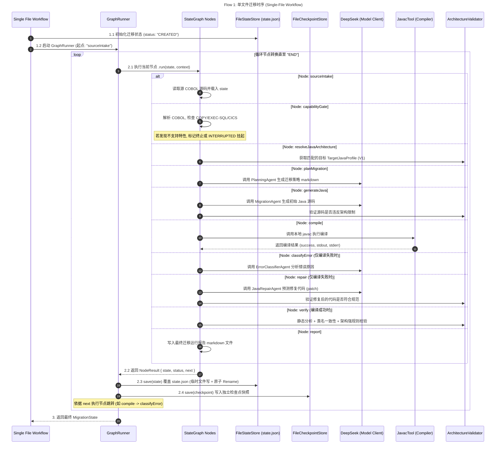
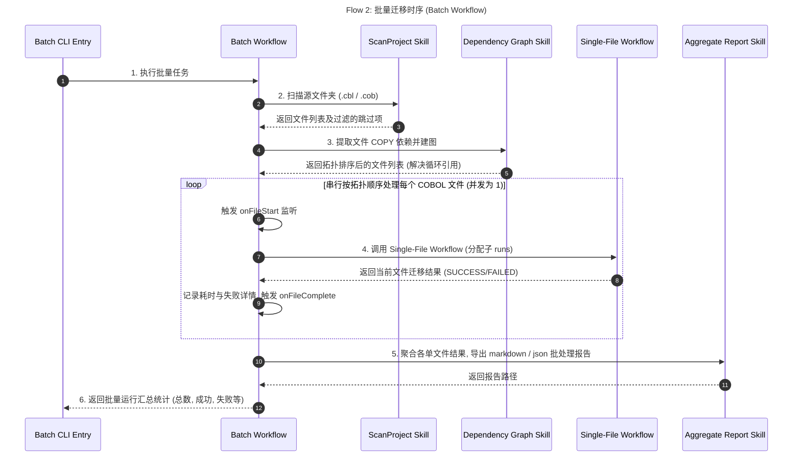
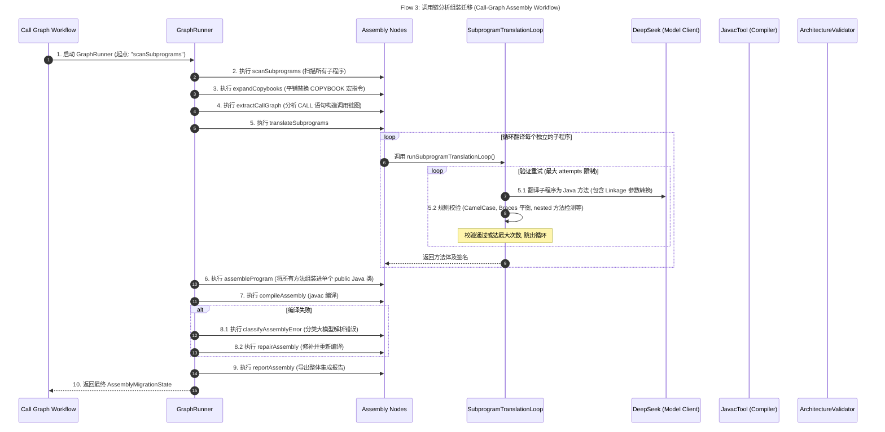
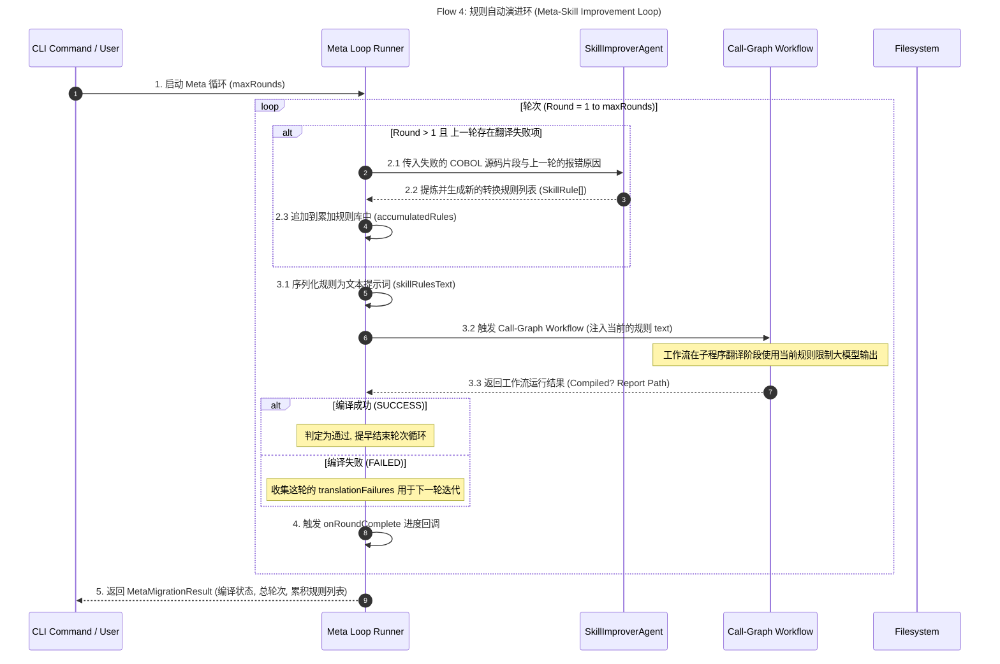

# Looper 项目架构与核心时序图规范

本项目是一个基于持久化状态图（State Graph）运行时和智能反馈优化环（Meta Loop）驱动的 COBOL 到 Java 自动迁移与验证引擎。为了提供极高细粒度的系统洞察，本篇文档整合了项目的**组件与依赖图（项目图）**以及**四大核心业务时序图**。

---

## 1. 项目组件与层级依赖图 (Project Component & Dependency Diagram)

本图描绘了 `looper` 的完整目录结构、关键源文件、核心层级划分以及模块之间的交互依赖流：

```mermaid
graph TD
    %% Styling Definitions
    classDef workflow fill:#e1f5fe,stroke:#0288d1,stroke-width:2px;
    classDef loop fill:#e8f5e9,stroke:#388e3c,stroke-width:2px;
    classDef node fill:#fffde7,stroke:#fbc02d,stroke-width:2px;
    classDef core fill:#ede7f6,stroke:#7b1fa2,stroke-width:2px;
    classDef agent fill:#ffebee,stroke:#c62828,stroke-width:2px;
    classDef arch fill:#fbe9e7,stroke:#d84315,stroke-width:2px;
    classDef tool fill:#eceff1,stroke:#455a64,stroke-width:2px;

    %% Layers
    subgraph "1. 工作流层 (src/workflows/)"
        BatchWF["[Batch]<br>cobol-to-java-batch.workflow.ts"]:::workflow
        SingleWF["[Single]<br>cobol-to-java-single-file.workflow.ts"]:::workflow
        CallGraphWF["[Call Graph]<br>cobol-call-graph-to-java.workflow.ts"]:::workflow
    end

    subgraph "2. 循环反馈层 (src/loops/)"
        MetaLoop["[Meta Feedback Loop]<br>meta-skill-improvement.loop.ts"]:::loop
        SubprogLoop["[Subprogram Translation Loop]<br>subprogram-translation.loop.ts"]:::loop
    end

    subgraph "3. 核心图运行时与持久化 (src/core/)"
        GraphRunner["[Graph Runner]<br>graph/graph.runner.ts"]:::core
        LoopRunner["[Generic Loop]<br>loop/loop-runner.ts"]:::core
        FileCheckpointStore["[Checkpoint Store]<br>checkpoint/file-checkpoint.store.ts"]:::core
        FileStateStore["[State Store]<br>storage/file-state-store.ts"]:::core
        TraceLogger["[Trace Log]<br>trace/trace-logger.ts"]:::core
        ArchPolicy["[Arch Interface]<br>architecture/architecture-policy.ts"]:::core
    end

    subgraph "4. 状态机业务节点 (src/nodes/)"
        subgraph "单文件迁移节点 (src/nodes/)"
            sourceIntake["source-intake.node.ts"]:::node
            capabilityGate["capability-gate.node.ts"]:::node
            analyzeCobol["analyze-cobol.node.ts"]:::node
            resolveJavaArchitecture["resolve-java-architecture.node.ts"]:::node
            planMigration["plan-migration.node.ts"]:::node
            generateJava["generate-java.node.ts"]:::node
            compile["compile.node.ts"]:::node
            classifyError["classify-error.node.ts"]:::node
            repair["repair.node.ts"]:::node
            verify["verify.node.ts"]:::node
            report["report.node.ts"]:::node
        end
        subgraph "调用链组装节点 (src/nodes/assembly/)"
            scanSubprograms["scan-subprograms.node.ts"]:::node
            expandCopybooks["expand-copybooks.node.ts"]:::node
            extractCallGraph["extract-call-graph.node.ts"]:::node
            translateSubprograms["translate-subprograms.node.ts"]:::node
            assembleProgram["assemble-program.node.ts"]:::node
            compileAssembly["compile-assembly.node.ts"]:::node
            classifyAssemblyError["classify-assembly-error.node.ts"]:::node
            repairAssembly["repair-assembly.node.ts"]:::node
            reportAssembly["report-assembly.node.ts"]:::node
        end
    end

    subgraph "5. 架构策略校验器 (src/architecture/)"
        ArchValidator["[Arch Validator]<br>java/architecture-validator.ts"]:::arch
        JavaProfile["[Java Profile]<br>java/target-java-profile.ts"]:::arch
    end

    subgraph "6. 大模型 Agent 层 (src/agents/)"
        PlanningAgent["[Planning Agent]<br>cobol-migration-agent.ts"]:::agent
        MigrationAgent["[Migration Agent]<br>cobol-migration-agent.ts"]:::agent
        JavaRepairAgent["[Repair Agent]<br>java-repair-agent.ts"]:::agent
        SkillImproverAgent["[Skill Improver Agent]<br>skill-improver.agent.ts"]:::agent
        SubprogTranslatorAgent["[Translator Agent]<br>subprogram-translator.agent.ts"]:::agent
        AssemblerAgent["[Assembler Agent]<br>program-assembler.agent.ts"]:::agent
    end

    subgraph "7. 底层命令与实体工具 (src/tools/)"
        JavacTool["[Javac Tool]<br>javac.tool.ts"]:::tool
        FilesystemTool["[FS Tool]<br>filesystem.tool.ts"]:::tool
        ShellTool["[Shell Adapter]<br>shell.tool.ts"]:::tool
    end

    %% Dependency Arrows
    BatchWF -->|依赖调用| SingleWF
    BatchWF -.->|扫描依赖关系| ScanSkill["skills/batch/scan-project.skill.ts"]
    BatchWF -.->|拓扑排序| BuildGraph["skills/batch/build-dependency-graph.skill.ts"]
    
    MetaLoop -->|执行主要流水线| CallGraphWF
    MetaLoop -->|大模型反思提炼规则| SkillImproverAgent
    MetaLoop -->|泛型迭代逻辑| LoopRunner
    
    SingleWF -->|实例化引擎运行时| GraphRunner
    SingleWF -->|按需加载| SingleNodes[Single-File Nodes]
    SingleWF -->|校验架构规范| ArchValidator
    
    CallGraphWF -->|实例化引擎运行时| GraphRunner
    CallGraphWF -->|加载组装流水线| AssemblyNodes[Assembly Nodes]
    
    SubprogLoop -->|泛型迭代逻辑| LoopRunner
    SubprogLoop -->|单方法转换| SubprogTranslatorAgent
    
    translateSubprograms -->|并发/循环翻译每个子程序| SubprogLoop

    GraphRunner -->|状态更新持久化| FileStateStore
    GraphRunner -->|生成还原检查点| FileCheckpointStore
    GraphRunner -->|追加日志追踪| TraceLogger

    %% Node to Agent/Tool bindings
    planMigration --> PlanningAgent
    generateJava --> MigrationAgent
    compile --> JavacTool
    classifyError --> ErrorClassifierAgent["[Error Classifier]<br>agents/error-classifier.agent.ts"]:::agent
    repair --> JavaRepairAgent
    verify --> ArchValidator
    
    compileAssembly --> JavacTool
    repairAssembly --> JavaRepairAgent
    assembleProgram --> AssemblerAgent

    ArchValidator --> JavaProfile
```



---

## 2. 核心流程时序图 (Full-Flow Sequence Diagrams)

由于系统支持四种不同的运行流程，这里以**极细粒度**分别拆解每种机制的时序交互过程：

````carousel

<!-- slide -->

<!-- slide -->

<!-- slide -->

````

---

## 3. 核心文件设计指南与时序强校验

为了确保迁移后的 Java 源码具有绝对的安全性与确定性，`src/architecture/java/architecture-validator.ts` 内部的时序审查包含以下细粒度检查逻辑：

| 校验编码 (Code) | 校验细节描述 | 时序影响与决策 |
| :--- | :--- | :--- |
| `SOURCE_TOO_LARGE` | 检测源码大小是否超过 `TargetJavaProfile.maxSourceBytes` (默认 256 KiB) | 超限则在 **generateJava** / **repair** 阶段直接判定为违规并触发重新规划。 |
| `PACKAGE_FORBIDDEN` | 代码不能包含 `package xxx;` 声明，仅允许 plain 结构 | 确保单文件 `javac` 可直接在输出目录编译。 |
| `EXTERNAL_IMPORT_FORBIDDEN` | 检查 `import` 是否在允许的前缀列表（仅限 `java.`，`javax.`）内 | 隔离依赖，防止模型任意引用外部未托管库。 |
| `FRAMEWORK_SYMBOL_FORBIDDEN` | 严格屏蔽任何 `org.springframework`、`hibernate` 等框架关键字 | 保证生成的代码是 100% 纯粹的纯 Java 逻辑。 |
| `SINGLE_TYPE_REQUIRED` | 代码中只能且必须声明一个类/接口/枚举/记录类型 | 强制生成平铺的面向过程转化 Java 代码，不得进行多文件拆分。 |
| `CLASS_NAME_MISMATCH` | 类名必须与工作流输入的 `className` 完美匹配 | 保证文件系统的文件名与 public 类名一致。 |
| `RUN_METHOD_REQUIRED` | 代码中必须包含 `public void run()` 方法 | 约定作为 COBOL `PROCEDURE DIVISION` 的主要控制入口。 |
| `MAIN_METHOD_REQUIRED` | 必须包含标准的 `public static void main(String[] args)` 静态入口 | 确保转成的 Java 代码开箱即用，支持独立命令行运行。 |
| `MAIN_MUST_DELEGATE` | main 方法内部必须显式委托给 `new ClassName().run()` | 限制 main 的职责仅作为实例化引导器，避免面向对象设计退化。 |

---

> [!TIP]
> 每一个时序状态的流转都严格依赖事务级更新保证。如果在流程中遭遇系统中断，可以利用 `runs/` 下对应的 `state.json` 结合 `checkpoints/` 快照，无缝恢复执行，而无需重复高昂的 LLM 调用开销。
